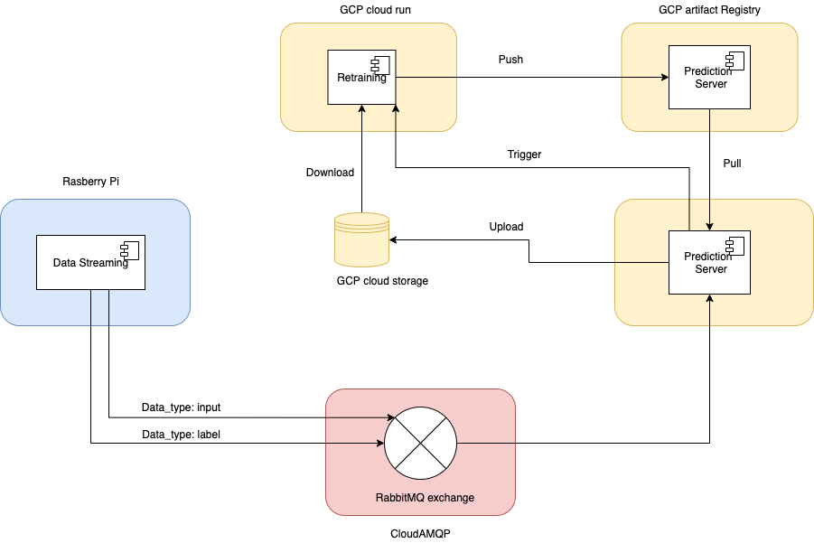
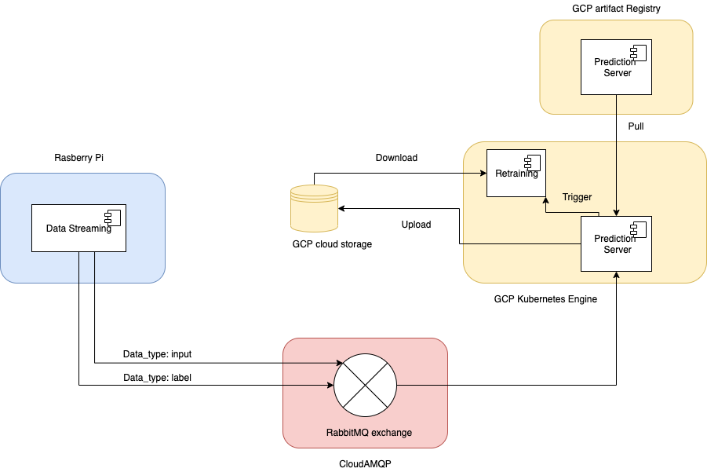

# Continuous Training and continuous testing
## Overview
The project illustrates the continuous training approach for an end-to-end ML system for predictive maintenance. The system contain 3 core components: data streaming, ML inference, and retraining of the ML model. The dataset used in this project is from the BTS dataset, divided by into small time windows, each consists of one day of power grid data, from a single station. The model is developed using LSTM, and is retrained with the new data that were collected and sent to the server for inference on the previous day, if the MSE > 0.1. The in-use model will be replaced by the new model if the new model outperform the old model on the test dataset.

In the current implementation, the data streaming is running either locally or on a rapsberry pi, the prediction server, and retraining is deployed as a container on GCP Kubernetes Engine, the data streaming and the server are communicating through a Rabbitmq exchange host on [CloudAMQP](https://www.cloudamqp.com/). The inference result is saved on GCP cloud storage, and downloaded for retraining.

## Architecture
### Design


In the orginal version, I plan to have a serverless container deployed on GCP cloud run to re-train the model, containerize the server, and push it to the artifact registry.

### Current version


In the current version, the retrain is done within the kubernetes node, because I find running docker inside a docker image quite fragile, and due to time constraint I have not come up with a good alternative solution yet.
## Demo
Since the server is deployed on GCP, we can try streaming the data by cloning the repository, installing pika, then running:
```
    python3 data_streaming/run_data_streaming.py
```

## Reflection
