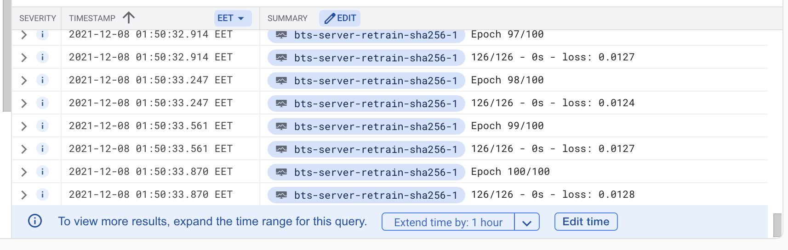

# Continuous Training and continuous testing
## Overview
The project illustrates the continuous training and testing approach for an end-to-end ML system for predictive maintenance in a distributed system, and discuss how can we scale the system effectively. 

When we serve a ML model for inference, the accuracy of the inference might deteriorate over time due to the shift in data distribution. Continuously re-train the model with new data might improve the model performance, and the reliablity of the service in the long run.

Furthermore, the project shows how can we achive robustness and resilience by utilizing Kubernetes cluster for model serving.
## Architecture
### Design


In the design, the system contain 3 core components: data streaming, ML inference, and retraining of the ML model. The dataset used in this project is from the BTS dataset, divided by into small time windows, each consists of one day of power grid data, from a single station. The model is developed using LSTM, and is retrained with the new data that were collected and sent to the server for inference on the previous day, everyday. The in-use model will be replaced by the new model if the new model outperform the old model on the test dataset.

The data streaming is running either locally or on a rapsberry pi, the prediction server is deployed as a container on GCP Kubernetes Engine, the retraining is running locally and scheduled to run everyday using Airflow, the data streaming and the server are communicating through a Rabbitmq exchange host on [CloudAMQP](https://www.cloudamqp.com/). The inference result is saved on GCP cloud storage, and downloaded for retraining.

The Kubernetes cluster for the prediction server is self-healing, can restart containers on failing 

Currently, the streaming, and retraining can be triggered manually if Airflow is not installed.


## Demo
### Prerequisite
The project use `tflite_runtime`, `numpy`, `pandas`, `pika`, `google-cloud-storage`, `apache-airflow`.

Install `tflite_runtime`:
``` 
pip3 install --extra-index-url https://google-coral.github.io/py-repo/ tflite_runtime
```
The rest can be installed through: 

```
pip3 install -r MLService/requirements.txt
``` 

Export Google cloud credential:
```
export GOOGLE_APPLICATION_CREDENTIALS="/Users/nguyenlinh/Macadamia/Advanced_SS_project/MLService/steel-climber-303808-7df11bf1a845.json"
```

If you want to test the scheduling with Airflow, firstly, we need to do some configuration.
Airflow will create a file `airflow.cfg` in the Airflow folder (`~/airflow` by default). Inside `airflow.cfg`, replace the `dags_folder` content with the absolute path to `MLService/dags`.

The you can quickly start by running:
```
airflow standalone
```

Standalone will initialise the database, make a user, and start all components automatically.

### Run
Since the server is deployed on GCP, we can try streaming the data by cloning the repository, installing pika, then start the data streaming by running:
```
    python3 data_streaming/run_streaming.py
```
In case, the data is not available on the running date, one can create a mock dataset for that day by changing the name of a file in `MLService/grouped_data` to `{MM_DD_YY}_1161114004_122_.csv`. At the moment, when the data is not ready, the data from `11_29_21_1161114004_122_.csv` is used by default.

The retraining can be triggered manually through:
```
    python3 MLService/Retrain/run_retrain.py
```

To test the project with airflow, export the dag for this project:
```
python3 {path}/MLService/dags/benchmark.py
```

Visit `http://0.0.0.0:8080/` or corresponding port that Airflow is run on, log in with username, and password provided on starting airflow with `airflow standalone`. Activate the dag, the dag will run at the scheduled time or run when it is triggered manually.


## How to scale with multiple model:
Scenario: instead of having only one model doing prediction for a specific station as we currently have now, in reality, a predictive maintenance service might need to take care of several BTS station. Because each station require a separate model trained on the data collected from the given station, we need the project to be more scalable, so that it can handle the retraining for several stations.

First of all, the retraining mechanism will need to be revised for scalability. Instead of having the retraining service scheduled by Airflow, we would have the retrain as it own server, and have a gcp cloud function listen to the file upload event, whenever the file upload event is sent, we will send a request to the retrain-server to trigger retraining for a particular model.

There are 2 ways of scaling the current architecture. Depending on the characteristic, and requirements of the service, we can scale the service either vertically or horizontally.

If the service only consists of a few of models, given that the training time of our model is not very significant, e.g: only a couple of minutes, we can scale the system vertically, and retrain all the model in the same node. Thus, once a new file is uploaded with an identification tag for a specific model, we look up the configuration for the given model which might contain the deployment information, and retrain, and deploy the model accordingly. With this vertical training approach, since the training time and deployment for each of our model is quite short, only a couple of minutes, eg 3 minutes (2 minutes to retrain, and 1 minutes to be pushed to the Artifact Registry), if we have 5 models, in the worst case scenario, they all require to be retrained at the same time, then it takes only 15 minutes for the last model in the queue to be retrained, and deployed, which is still an exceptable amount of time.

However, in case we have a very large amount of models, or/and each of them takes a significant amount of time to be retrained, the vertical training approach is not applicable anymore, because it would take too much time for some models in the queue to be retrained. Possibly, the models are already due for another retrain before they get retrained for the first time. Thus, in this case, we would adopt a horizontal scaling approach. That means we would add additional nodes or machine to handle the traffic, and ensure reasonable model retraining time. This can be done through having a several node on a cluster, and have a load balancer to distribute retrain request, or having a designate node for a single or a few models.

## Reflection
### The most challenging aspect



The most challenging aspect in this project for me was debugging container running on Kubernetes Engine. Because, unlike local machine or a standard local machine where you can log in and debug your code directly, most of the debugging is done though the Kubernetes log on GCP, and I have to containerize and deploy the new container everytime a change or a new log is added for the debugging purpose, which is very time consuming. On top of that, in my experience, the logging system on Kubernetes Engine on GCP does not work correctly, and sometimes terminate the process before all the logs were printed out, therefore, can be very misleading on whether the code is ran correctly. For instance, the above picture indicates that the service seems to be frozen after finishing fitting LSTM model with new data. However, further debuggings discover that service still continues to work correctly, but the log gets stuck. This issue is currently dealt with using `sys.stdout.flush()`.


### The most interesting aspect

The most interesting challenge in the project is that the input need to be normalised according to the mean and max values of the data used to current serving LSTM model. Thus, doing data preprocessing from the client front can cause misleading result, because the model can be replaced quite often. To overcome this, the data normalization is currently handled in the server, where mean and max is always updated.